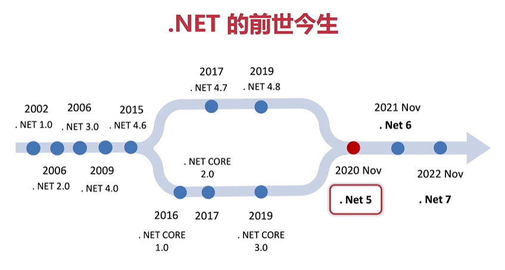
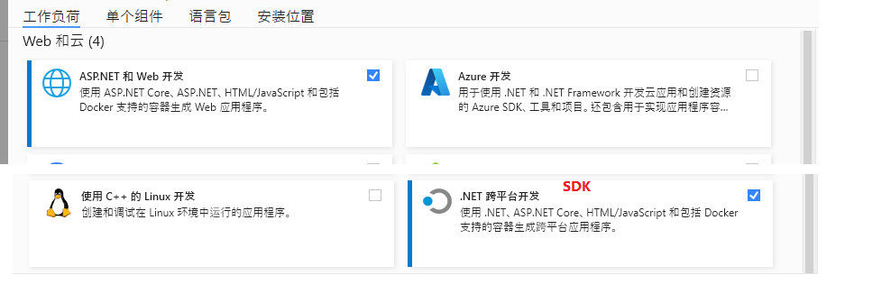

# ASP .Net Core MVC

## .Net 历史

- .net framework 与 .net core 不同的产品
- .net framework 早期 闭塞
- .net core 后来者 开源跨平台
- .net core MVC 开发时框架

    

## 安装 .net core && sdk

- 通过 visual studio 安装
    

## 创建项目

- 创建 .Net core Empty

### 项目目录 

### nuGet

- c# 的包管理工具

## 增量

1. 开发思维
2. 代码过程 规范
3. 设计模式
4. 系统架构 路基，运行，数据，物理

