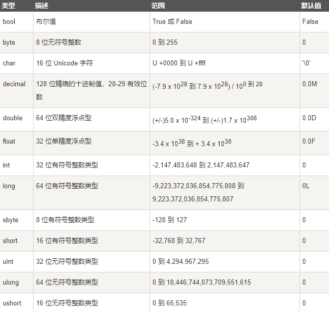
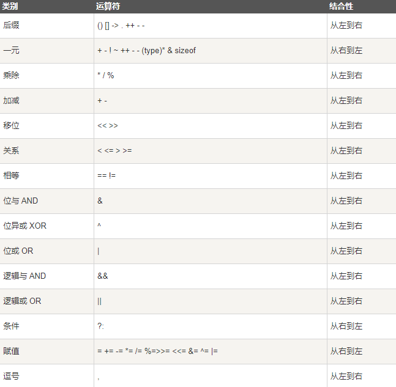
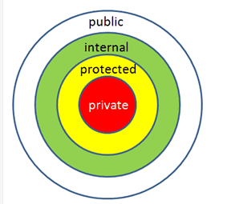

# C#

- 特点： 
    1. 面向对象
    2. 面向组件
    3. .Net Framework 的一部分
    4. 区分大小写
    5. 以分号结尾
    6. 只有一个main 函数, main 函数 类名可以和文件名不同
    7. 类似ts的 tsc 可以使用 csc 编译文件  ...  *环境变量还没加好，以后再试*


## hello world

- File > New > Project  C#, windows, console App

    ```c#
    using System;   //use namespace

    namespace ConsoleApp1   //create namespace
    {
        class Program       //class
        {
            static void Main(string[] args) //entry point
            {
                string Hello = "hello wrold";
                Console.WriteLine(Hello);
            }
        }
    }
    ```

## 关键字

- C# 关键字保留字

    

##  变量 

1. 声明变量 Declaration

    ```c#
    string name;        //string 类型
    var a = "string";   //编辑器会自行判断 a 的类型
    ```
    > c# 强类型，必须规定类型 或  var 类型


- C# 有三种类型数据 值类型 (value types)， 引用类型(reference types)， 指针类型(pointer types)

1. 值类型

    - 声明会分配内存,值类型变量直接包含数据

    

2. 引用类型

    - 不包含数据， 仅包含 指向数据的索引
    - 包含 Object, dynamic String,

    ```c#
    dynamic a = 111;  //动态变量
    a = "111Str"        //num -> str

    String b = "222";   //不知道和小写的 string 有啥区别
    string c = "333";
    object e = "444";   //object 可以存储 string
    Console.WriteLine(a);   //111Str  
    Console.WriteLine(b);   //222
    Console.WriteLine(c);   //333
    Console.WriteLine(e);   //444
    ```

3. 指针类型

    ```C#
        char* cptr;
        int* iptr;
    ```

## 类型转换

1. 显示类型转换

    ```c#
        double d = 567.89
        int i;
        i = (int)d;     //dbl -> int
        Console.WriteLine(i);   //567
    ```
2. 类型转换方法

    方法 | 功能
    -|-
    ToBoolean | 数字，字符串，转不了，
    ToByte | 
    ToChar | 
    ToDateTime | 
    ToDecimal | ->十进制
    ToDouble | 
    ToString | 
    ToInt16 | 

## 变量 & 常量

- 声明 & 赋值

    ```c#
        string a; //仅声明
        int a1,b1,c1;      //同时声明多个变量
        string b = "123";   //声明变量且赋值
        a1 = 11;            //变量赋值

        const string bathPath = "c:/desktop;    //定义 常量
        //常量不能修改
    ```

## 运算符

- differents

    运算符 | 功能 | demo
    -|-|-
    sizeof() | 返回数据类型的的大小 | sizeof(int);
    typeof() | 返回class 的类型  | typeof();
    & | 返回变量的地址 | &a; 得到a 的地址
    is | 判断对象是否为某类型 | if(Ford is Car) 
    as | 强制转换， 失败不会throw errow | 

- 优先级 & 结合律 

    

## 封装 和 抽象 

- 抽象： 提取公共部分，interface
- 封装： 掩盖过程， 通过 访问权限符

    访问符 | 功能 
    -|-
    public | 所有对象都可以访问
    private | 仅本对象内可访问
    protected | 仅本对象 和 子类可访问
    internal | 同程序的对象可访问
    protected internal | 或 protected 或 internal

    

## 方法

- 定义 

    ```c# 

    //  <Access Specifier> <return type> <method name> (parameter list){ method body }
    class Program
    {
        static void Main(string[] args)
        {
         
            Fun f = new Fun();          //new 0个参数的构造器   获得实例
            Fun f1 = new Fun("XiaoMing"); //new 1个string的构造器 获得实例
            Fun f2 = new Fun(19);       //new 1个int 的构造器   获得实例

            //调用 其他类 实例方法  
            f.sayHello();               //im weibin and 18 years old
            f1.sayHello();              //im XiaoMing and 18 years old
            f2.sayHello();              //im weibin and 19 years old

            //调用自身  方法 也需要new实例

            //this.sayHi();             //error  static 没有 this
            Program p = new Program();  
            p.sayHi();                  //hi weibin
            //静态方法 可以直接调用
            Fun.sayHaha();              //hhhh
        }

        public void sayHi(string name = "weibin")
        {
            Console.WriteLine("hi " + name);
        }
    }

   public class Fun
    {
        public string name = "weibin";      //成员变量需要在 类的最外层定义
        public int age = 18;
        public Fun(string name)     //构造器
        {
            this.name = name;
            sayHaha();
        }
        public Fun()
        {

        }

        public Fun(int age)
        {
            this.age = age;   
        }

        public void sayHello()          //成员方法
        {
            Console.WriteLine("I'm " + this.name + " and " + this.age + " years old.");
        }

        public static void sayHaha()   //公共静态方法
        {
            Console.WriteLine("hhhhh");
        }
    }
    ```

    > 定义时注意 访问符 返回类型 name 
    > 调用时 除static fun 其他的 需要 new得到实例 调用，
    > 方法传入的参数 可以用  ret(索引)， out() 来修饰.   不修饰 传入 克隆值，修饰传入索引。

## 可空类型  Nullable

- ?

    ```c# 
    int? i;     //null
    int j;      //0
    ```
    > 可以使 定义的 变量 赋值null， 默认值 null

- ?? 与 ts相同 

    ```c# 
    int? num1 = null;
    int? num2 = 0;
    int num3 = 777;
    int res;
    res = num1 ?? num3;
    Console.WriteLine(res); //777
    res = num2 ?? num3;
    Console.WriteLine(res); //0
    //res = num1 || num3;   在ts中的或赋值  在c# 中不可以
    ```
    > 类似 || 的赋值，区别 0 可以通过

## 数组 datatype[] arrayName;

- 创建数组  字面量， 构造函数

    ```c#
    // 利用构造函数
    string[] arr;
    //Console.WriteLine(arr);           //Err 变量需要赋值后再使用
    arr = new string[4]{"111","222","333"};   //声明 长度4的数组 且 给前三位赋值
    Console.WriteLine(arr[3] == null);      //true
    arr[3] = "444";
    Console.WriteLine(arr[3]);      //444
    //arr[4] = "out";               Err out range
    //Console.WriteLine(arr);  

    //字面量
    string[] arr2 = {"111", "222", "333"};  // 注意这里 用的花括号
    Console.WriteLine(arr2[0]);
    //Console.WriteLine(arr[3]);    Err out range
    ```

    > c# 数组 长度不能自动拓展, 超界会报错。
    > 变量需要先赋值 再使用

## 字符串

- 创建字符串

    ```c#
    //字面量
    string hello = "hello";         //注意只能用双引号 

    // 通过构造函数 

    char[] msgChar = { 'h', 'e', 'l', 'l', 'o' };      //char 类型 用单引号
    Console.WriteLine(msgChar);                 //hello
    string msgStr = new string(msgChar);
    Console.WriteLine(msgStr);                  //hello
    ```

- 字符串方法

    方法 | 功能 | 返回值 
    -|-|-
    String.Compare(str1,str2) | 比较 字符串大小 | -1， 0， 1 分别表示 < = >
    String.Compare(str1,str2,igCase) | 比较字符串大小 是否忽略 大小写 | -1， 0， 1
    String.Concat(str1,str2,...) | 拼接字符串 | str
    str1.Contains(str2) | str1是否包含str2 | bool
    String.Equal(str1,str2) | str1, str2 是否相等 | bool
    str1.indexOf(str2) | str2 在str1第一次出现的索引 | int
    str1.LastIndexOf(str2) | str2 在str1最后一次出现的索引 | int
    String.isNullOrEmpty(str) | 判断str 为空或null | bool
    str.split('k') | 将str通过k分割成数组 | str[]
    str.ToLower() | 变小写 | str
    str.ToUpper() | 变大写 | str
    str.Trim() | 移除前后的空格 | str

    > 字符串的很多操作  应该可以用  正则 来搞

## struct 结构体

- 复杂的值类型

    ```c#
    class Program
    {
        static void Main(string[] args) // main
        {
            StrcutBooks sb;     //声明 struct
            sb.id = 123;            //赋值
            sb.title = "sb";
            Console.WriteLine(sb.title);    //sb
        

            ClassBooks cb = new ClassBooks();   //构造实例  有默认值
            Console.WriteLine(cb.id);           //1234
            cb.id = 321;
            Console.WriteLine(cb.id);           //321
        
        }
    }


    public struct StrcutBooks
    {
        internal int id;
        internal string title;
    }

    public class ClassBooks
    {
        internal int id = 1234;
        internal string title = "好书";
        public ClassBooks() {       //构造函数
        }
    }

    ```

- struct VS classs

    - class 是引用类型， struct 是值类型， 
    - struct 不能继承
    - struct 无 初始值

## 枚举

- 一组 命名的  整型  常量

    ```c#
    enum pages
    {
        home,
        login,
        register
    }
    ```

## 类

- 创建

    ```c#
    using System;   //use namespace

    namespace ConsoleApp1   //create namespace
    {
        class Steps
        {
            public string step;
            public string defaultStep = "000";
            public static string keys = "456";
            public Steps(string a) {    //构造函数 同名且 不写返回值， void 也不可以
                this.step = a;
            }

            public Steps()              //可以有多个构造函数通过传参区分
            {

            }

            public void sayCurrent()    //成员函数
            {
                string type = "number";     //局部变量   貌似不能有access 修饰符
                Console.WriteLine(step + type);
            }

            public void sayDefault()
            {
                Console.WriteLine(defaultStep);
            }
            //static void Main(string[] args)       //可以多个类  不能多个  Main
            //{
            //    Console.WriteLine("www");
            //}
        }
        class Programxx       //
        {
            static void Main(string[] args) //entry point
            {
                Steps s = new Steps("001");         //通过构造函数创建对象
                s.sayCurrent();                     //调用实例方法
                s.sayDefault();
                Steps.keys = "changed keys";        //static 可以修改和直接访问
                Console.WriteLine(Steps.keys);
                Steps s2 = new Steps();
                Console.WriteLine(s2.defaultStep);  
            }
        }
    }
    ```
    > 对象是类的实例， 构成类的方法和变量，称为类的成员
    > 构造器  区分参数长度和 类型


