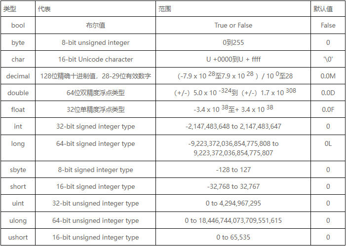

# C#

- 特点： 
    1. 面向对象
    2. 面向组件
    3. .Net Framework 的一部分
    4. 区分大小是写
    5. 以分号结尾


## hello world

- File > New > Project  C#, windows, console App

    ```c#
    using System;   //use namespace

    namespace ConsoleApp1   //create namespace
    {
        class Program       //class
        {
            static void Main(string[] args) //entry point
            {
                string Hello = "hello wrold";
                Console.WriteLine(Hello);
            }
        }
    }
    ```

## 关键字

- C# 关键字保留字

    

## 数据类型

- C# 有三种类型数据 值类型， 参考类型， 指针类型

1. 值类型

    

2. 参考类型

    - 包含 Object, dynamic String,

    ```c#
    dynamic a = "111";  //动态变量
    String b = "222";   //不知道和小写的 string 有啥区别
    string c = "333";
    object e = "444";   //object 是 string
    Console.WriteLine(a);   //111  
    Console.WriteLine(b);   //222
    Console.WriteLine(c);   //333
    Console.WriteLine(e);   //444
    ```

3. 指针类型

    TODO

## 类型转换

1. 显示类型转换

    ```c#
        double d = 567.89
        int i;
        i = (int)d;
        Console.WriteLine(i);   //567
    ```
2. 类型转换方法

    方法 | 功能
    -|-
    ToBoolean | 
    ToByte | 
    ToChar | 
    ToDateTime | 
    ToDecimal | ->十进制
    ToDouble | 
    ToString | 
    ToInt16 | 


## 类

- 创建

    ```c#
    using System;   //use namespace

    namespace ConsoleApp1   //create namespace
    {
        class Steps
        {
            public string step;
            public string defaultStep = "000";
            public static string keys = "456";
            public Steps(string a) {    //构造函数 同名且 不写返回值， void 也不可以
                this.step = a;
            }

            public Steps()              //可以有多个构造函数通过传参区分
            {

            }

            public void sayCurrent()    //成员函数
            {
                string type = "number";     //局部变量   貌似不能有access 修饰符
                Console.WriteLine(step + type);
            }

            public void sayDefault()
            {
                Console.WriteLine(defaultStep);
            }
            //static void Main(string[] args)       //可以多个类  不能多个  Main
            //{
            //    Console.WriteLine("www");
            //}
        }
        class Programxx       //
        {
            static void Main(string[] args) //entry point
            {
                Steps s = new Steps("001");         //通过构造函数创建对象
                s.sayCurrent();                     //调用实例方法
                s.sayDefault();
                Steps.keys = "changed keys";        //static 可以修改和直接访问
                Console.WriteLine(Steps.keys);
                Steps s2 = new Steps();
                Console.WriteLine(s2.defaultStep);  
            }
        }
    }
    ```

TODO  多继承  多态  重载 。。。。
- 面向对象，面向组件， 运行在.Net上


### 访问符