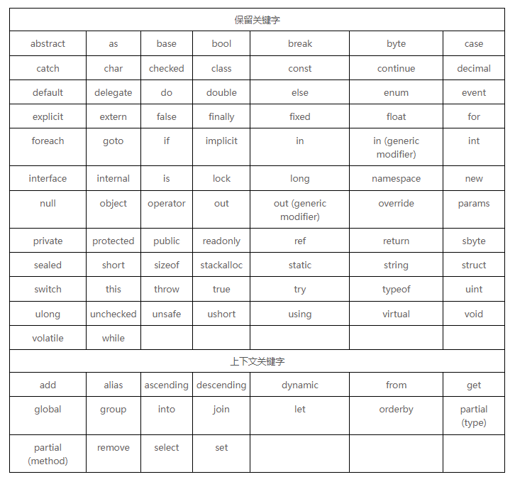

# C#

- 特点： 
    1. 面向对象
    2. 面向组件
    3. .Net Framework 的一部分
    4. 区分大小是写
    5. 以分号结尾


## hello world

- File > New > Project  C#, windows, console App

    ```c#
    using System;   //use namespace

    namespace ConsoleApp1   //create namespace
    {
        class Program       //class
        {
            static void Main(string[] args) //entry point
            {
                Console.WriteLine("Hello World!");
            }
        }
    }
    ```

## 关键字

- C# 关键字保留字

    

## 数据类型

- C# 有三种类型数据 值类型， 参考类型， 指针类型

1. 值类型

    

2. 参考类型

    - 包含 Object, dynamic String,

    ```c#
    dynamic a = "111";  //动态变量
    String b = "222";   //不知道和小写的 string 有啥区别
    string c = "333";
    object e = "444";   //object 是 string
    Console.WriteLine(a);   //111  
    Console.WriteLine(b);   //222
    Console.WriteLine(c);   //333
    Console.WriteLine(e);   //444
    ```

3. 指针类型

TODO

## 类型转换

1. 显示类型转换

    ```c#
        double d = 567.89
        int i;
        i = (int)d;
        Console.WriteLine(i);   //567
    ```
2. 类型转换方法

    方法 | 功能
    -|-
    ToBoolean | 
    ToByte | 
    ToChar | 
    ToDateTime | 
    ToDecimal | ->十进制
    ToDouble | 
    ToString | 
    ToInt16 | 


## 类

1. constroctor 是与类同名的  函数
2. 继承  用 : 表示


TODO  多继承  多态  重载 。。。。