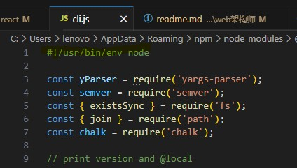

# 架构师

- 通过技术 对业务 负责
- 进度  

## 架构思维

- 全局
- 整体
- 闭环

## 需求分析

- 已架构师思维 分析需求 考虑到业务增长 全局整体闭环
- 浅层需求
- 深层需求

### 分析需求， 确定需要创建的项目


## 项目关系


## 数据结构


## 技术方案设计 文档

## 流程图


## 关键词

1. 流程图 - 分析需求工具
2. 全局思维， 整体四维， 闭环思维 - 以架构师思维分析需求
3. 业务组件库 - 拆分 复用
4. 自定义事件统计 - 业务的重要性如何实现？


1. 登录注册， 个人信息（地址）
2. 奖品summary页面
2. 剩余抽奖次数查询
3. 抽奖 接口
4. 兑奖 相关接口（物流显示，兑换，，）
5. 

## 4-5 数据结构设计

- json, components use array.

## 脚手架 cli

- 操作系统的一个客户端

实现得功能： 创建项目， 发布项目，组建管理 等功能

- jekins 等自动化发布工具 无法实现 本地的自动化， 以及 自动化进程 不容易捕获 统计等。


```shell
$ vue create vue-tet-app --force
# vue comand [options] <params>
```
- 主命令: `vue`
- command : `create`
- param : `vue-test-app`
- option: `--force`


### 实现原理

- 通过命令行， 执行 vue.js 文件 

```shell
$ where.exe vue
# C:\Users\lenovo\AppData\Roaming\npm\node_modules\@vue\cli\bin\vue.js
# C:\Users\lenovo\AppData\Roaming\npm\vue
# C:\Users\lenovo\AppData\Roaming\npm\vue.cmd

$ vue -V

# 安装过node 后 node会创建一个 npm 的环境变量 C:\Users\lenovo\AppData\Roaming\npm
# 通过node安装的 VUE 在 C:\Users\lenovo\AppData\Roaming\npm\vue 下, 执行这个文件找到 vue.js
# vue.js 文件 有 调用 node 环境来执行 js文件 '#!/usr/bin/env node'

```



### 简单实现

1. [注册登录NPM](https://www.npmjs.com/settings/96weibin/packages) 注意使用源 https://registry.npmjs.org
2. [创建npm目录，添加可执行文件](./submd//创建npm包文件.md)
3. 发布包

    ```shell
    $ npm login
    $ npm publish
    ```
4. 下载使用
    
    ```shell
    $ npm i -g wb230904
    $ wb
    # this is a cli test
    ```
